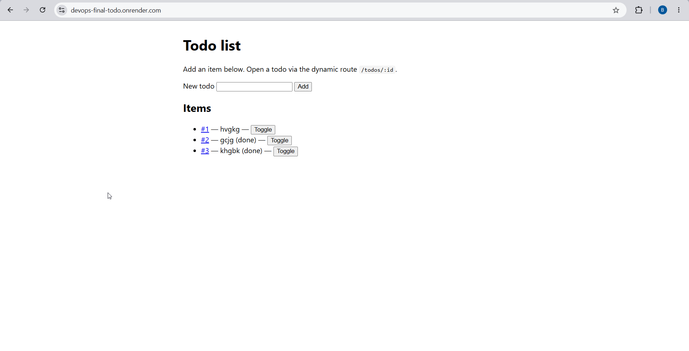
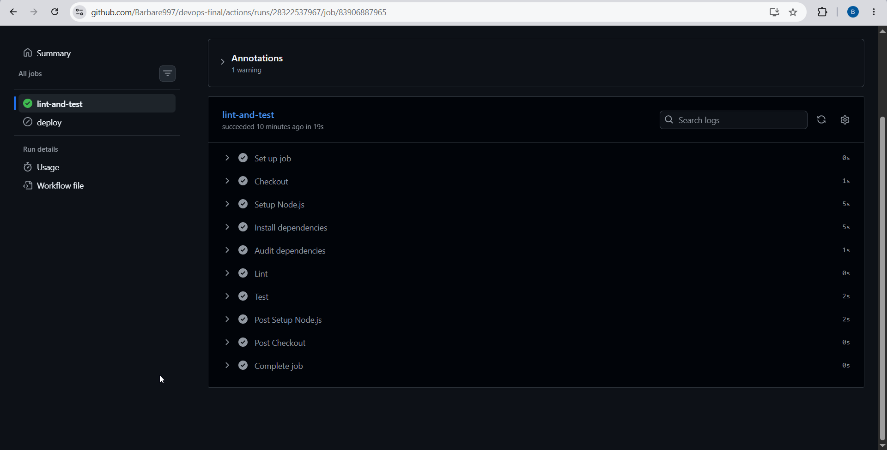
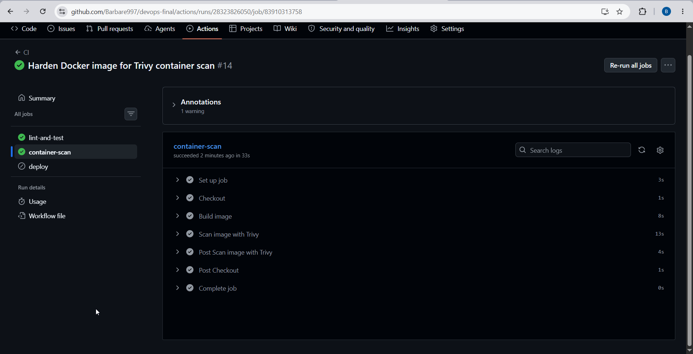
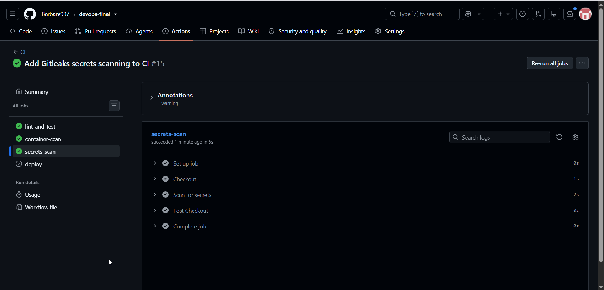
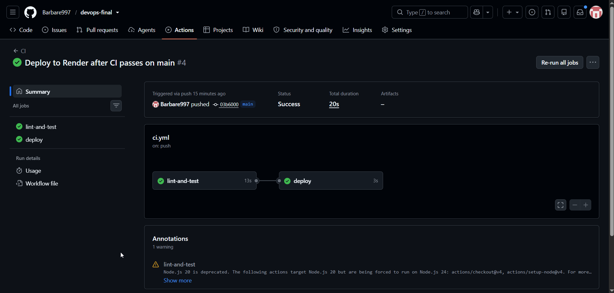
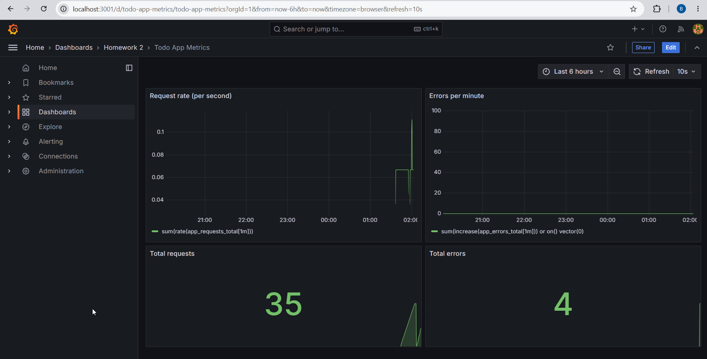
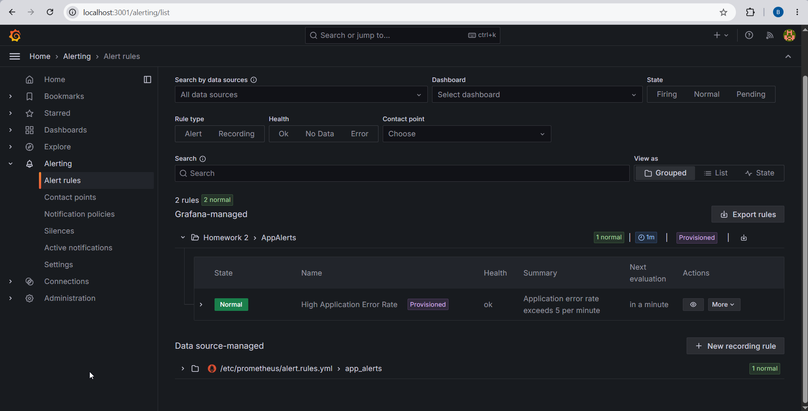
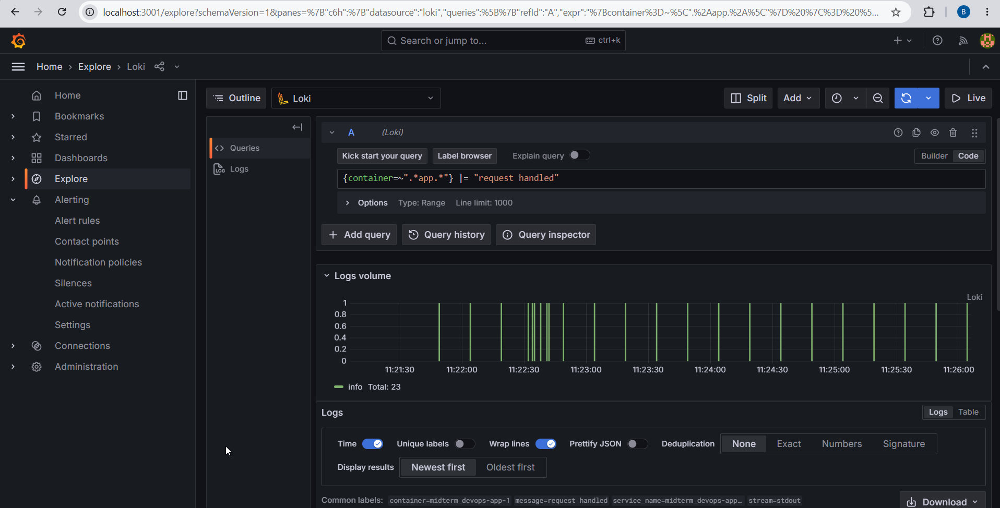

# DevOps Todo App

Todo list web application with CI/CD to Render, infrastructure automation, blue-green deployment simulation, rollback scripts, and periodic health monitoring.

## Tech stack

- Node.js 18+
- Express
- Jest + Supertest
- ESLint
- GitHub Actions
- Ansible
- Docker Compose
- Prometheus + Grafana
- Loki + Promtail

## Application

- Dynamic route: `GET /todos/:id`
- Input endpoint: `POST /todos`
- Form UI: `GET /`
- Health endpoint: `GET /health`
- Prometheus metrics: `GET /metrics` (`app_requests_total`, `app_errors_total`)
- JSON request logs (stdout)
- Debug endpoint: `GET /debug/error` (returns 500 — used to test alerts)

## Local setup

```bash
npm ci
npm run lint
npm test
npm start
```

Windows PowerShell (same steps; run from the repo folder):

```powershell
npm ci
npm run lint
npm test
npm start
```

App URL: `http://localhost:3000/`

## Live application (Render)

**URL:** https://devops-final-todo.onrender.com

Health check: https://devops-final-todo.onrender.com/health

Hosted on [Render](https://render.com) (free tier). After a period of inactivity the service may take ~30 seconds to wake up on the first request.



## Blue-green deployment simulation

Run two app instances:

- Blue: port `3001`
- Green: port `3002`

Use **three terminals**. If PowerShell blocks scripts, run once per session:

```powershell
Set-ExecutionPolicy -Scope Process -ExecutionPolicy Bypass
```

**Windows PowerShell**

Terminal A (blue):

```powershell
$env:PORT="3001"
$env:DEPLOY_SLOT="blue"
$env:APP_VERSION="1"
npm start
```

Terminal B (green):

```powershell
$env:PORT="3002"
$env:DEPLOY_SLOT="green"
$env:APP_VERSION="2"
npm start
```

Terminal C (router):

```powershell
npm run start:router
```

**macOS / Linux**

Terminal A (blue):

```bash
PORT=3001 DEPLOY_SLOT=blue APP_VERSION=1 npm start
```

Terminal B (green):

```bash
PORT=3002 DEPLOY_SLOT=green APP_VERSION=2 npm start
```

Terminal C (router):

```bash
npm run start:router
```

Router URL: `http://localhost:8080/`

Switch active traffic:

- Windows: `.\scripts\switch-traffic.ps1`
- Linux/macOS: `bash scripts/switch-traffic.sh`

Rollback:

- Windows: `.\scripts\rollback.ps1`
- Linux/macOS: `bash scripts/rollback.sh`

## Monitoring

Periodic health checks are logged to `logs/health.log`.

- Windows: `.\scripts\health-monitor.ps1`
- Linux/macOS: `bash scripts/health-monitor.sh`

## Observability stack (Docker Compose)

The Docker stack runs the todo app with Prometheus, Grafana, Loki, and Promtail.

Start everything:

```bash
docker compose up -d
```

Windows PowerShell:

```powershell
docker compose up -d
docker compose ps
```

Check that `app`, `prometheus`, `grafana`, `loki`, and `promtail` are all **Up**.

| Service | URL |
|---------|-----|
| App | http://localhost:3000 |
| Prometheus | http://localhost:9090 |
| Grafana | http://localhost:3001 (`admin` / `admin`) |
| Loki | http://localhost:3100 |

Stop:

```bash
docker compose down
```

### Architecture diagram

```
Todo app (Docker)
   |  JSON logs to stdout
   |  GET /metrics
   v
Promtail ----------------------> Loki --------> Grafana Explore (logs)
   ^                                              ^
   | reads container logs                         |
   |                                              |
Prometheus <--- scrapes /metrics --- App          +--- dashboards + alerts
```

### Logging strategy

Each HTTP request is logged as one JSON line in `src/logger.js` (`timestamp`, `level`, `message`, `method`, `path`, `status`, `durationMs`).

Promtail picks up the app container logs and sends them to Loki. In Grafana Explore (Loki datasource), I filter with:

```logql
{container=~".*app.*"} |= "request handled"
```

Metrics are separate: Prometheus scrapes `/metrics` every 15 seconds. Custom counters are `app_requests_total` and `app_errors_total` in `src/metrics.js`.

### Alerting

Prometheus rule in `prometheus/alert.rules.yml`:

`sum(increase(app_errors_total[1m])) > 5`

Grafana has the same rule as **High Application Error Rate** under **Alerting → Alert rules**.

### Simulate the CRITICAL alert

1. Run `docker compose up -d`
2. Generate errors (more than 5 in one minute), e.g. in PowerShell:

```powershell
1..10 | ForEach-Object { try { Invoke-WebRequest "http://localhost:3000/debug/error" -UseBasicParsing } catch {} }
```

Or hit http://localhost:3000/debug/error in the browser several times.

3. After about a minute, check **Grafana → Alerting → Alert rules** or **Prometheus → Alerts** at http://localhost:9090/alerts

### Analysis

**Why is JSON logging better than plain text?**

With JSON you can filter on fields like `status` or `path` directly in Loki. Plain text logs need regex or manual parsing, and that gets messy when the log format changes.

**Prometheus vs Loki?**

Prometheus keeps numbers over time (request counts, error rates) — useful for graphs and alerts. Loki keeps the actual log lines — useful when you need to see what one request did. Metrics show trends; logs show details.

**Keeping logs for 6 months without running out of disk?**

Set a retention period in Loki so old logs are deleted automatically. For longer storage, move data to object storage (e.g. S3). Also avoid logging too much: drop debug noise in production and put high-volume numbers in Prometheus instead of logs.

## Infrastructure automation

```bash
ansible-playbook ansible/site.yml
```

On Windows, run this from **WSL (Ubuntu)**. Install Ansible inside WSL (`sudo apt install ansible`), `cd` to the project path under `/mnt/c/...`, then run the command above. The playbook still targets the same repo files on your Windows drive.

## CI/CD pipeline

Workflow file: `.github/workflows/ci.yml`

On every push and pull request:

- `npm ci`
- `npm audit --audit-level=high` (blocks high/critical dependency issues)
- `npm run lint`
- `npm test`
- Docker image build + Trivy scan (blocks critical/high image CVEs)
- Gitleaks secrets scan (blocks leaked tokens/keys in the repo)

On push to `main` only (after all jobs above succeed):

- Deploy to Render via deploy hook (`RENDER_DEPLOY_HOOK` secret)

Render auto-deploy is **off**; production deploys run only from GitHub Actions.

If lint, tests, security scans, or container scan fail, the workflow stops and the **deploy** job does not run.

## Security automation

Three security checks run in CI on every push and pull request:

| Check | Tool | What it does |
|-------|------|--------------|
| Dependency scan | `npm audit` | Finds known vulnerabilities in npm packages; fails on high/critical |
| Container scan | Trivy | Builds the Docker image and scans OS + app packages for CVEs |
| Secrets scan | Gitleaks | Scans git history for accidentally committed API keys, tokens, passwords |

The Docker image is hardened for production: Alpine packages are upgraded, bundled `npm` is removed after install (not needed at runtime), and the app starts with `node src/server.js` directly.







## Deployment strategy

**Chosen strategy: Blue-Green** (with a local simulation and Recreate-style deploy on Render).

**Production (Render):** Each successful pipeline run triggers a new deploy that replaces the running build. Render free tier does not support two live production slots, so cloud updates follow a **Recreate** pattern: stop old build, start new one. CI must pass before the deploy hook runs.

**Local simulation (blue-green):** Two app instances run in parallel (blue on `:3001`, green on `:3002`). A router on `:8080` reads `data/active-target.json` and forwards traffic to the active slot. `switch-traffic` moves traffic to the new version; `rollback` restores the previous target without restarting both apps.

This setup shows zero-downtime switching locally while keeping cloud delivery simple on free tier.

### Rollback on Render

1. Open the service in the [Render dashboard](https://dashboard.render.com).
2. Go to **Events** (or **Deploys**).
3. Find a previous successful deploy.
4. Click **Rollback** (or **Redeploy** on that commit).

The app rolls back to that build without changing Git history.

## Screenshots

### CI — workflow runs (`main` and `dev`)


### CI — job summary (green run)


### CI — lint and test steps (expanded log)


### CI/CD — deploy to Render after tests pass (`main`)



### Ansible


### Deployment — app through router (`http://localhost:8080`)


### Blue-green — switch and rollback (terminal output)


### Monitoring — health log (`logs/health.log`)


### Observability — Grafana metrics dashboard



### Observability — Grafana alert rule



### Observability — JSON logs in Grafana Explore (Loki)



### CI/CD workflow diagram

```
Developer
   |
   |  git push / pull request
   v
GitHub Actions (CI/CD)
   |-- npm ci
   |-- npm audit (high/critical)
   |-- npm run lint
   |-- npm test
   |-- Trivy container scan
   |-- Gitleaks secrets scan
   '-- deploy to Render (main only, after all jobs pass)

Developer machine (local "production" demo)
   |
   |  ansible-playbook ansible/site.yml  (environment prep)
   v
Two backends
   |-- Blue app  :3001
   '-- Green app :3002
           ^
           |
   Router :8080 (src/router.js)
           |
           |  reads
           v
   data/active-target.json
      ^            ^
      |            |
      |     switch-traffic script
      |            |
      '---- rollback script

Health monitor script
   |
   |  polls http://localhost:8080/health
   v
logs/health.log
```

## Repository

https://github.com/Barbare997/devops-final

