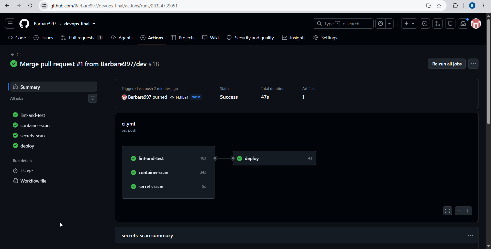
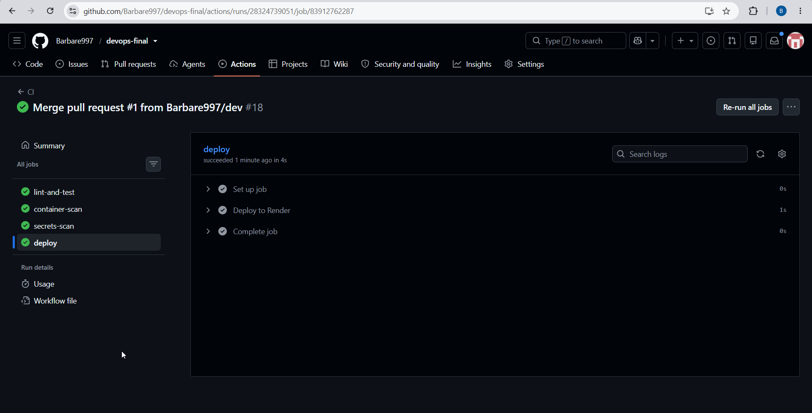

# DevOps Todo App

Semester DevOps project built on one Node.js todo app. Same repo covers midterm (CI, Ansible, blue-green), homework (Render deploy, observability stack), and the final project (security scans, hardened Docker image, post-deploy checks).

**Live app:** https://devops-final-todo.onrender.com  
**Repo:** https://github.com/Barbare997/devops-final

Branches: `main` (production deploys) and `dev` (day-to-day work).

---

## Architecture

```
Developer push / PR
        |
        v
GitHub Actions
   |-- lint + test + npm audit
   |-- Trivy (config + container)
   |-- Gitleaks
   '-- deploy hook (main only) --> Render
                                      |
                               /health check in CI

Local / evaluation (free tools, no paid cloud required)
   |
   |-- docker compose up -d  OR  .\scripts\start-env.ps1
   |       app :3000, Prometheus :9090, Grafana :3001, Loki, Promtail
   |
   |-- ansible-playbook ansible/site.yml  (folders + Node on Debian/Ubuntu)
   |
   '-- blue/green demo: two backends + router :8080 + switch/rollback scripts
```

The app itself is small: Express, in-memory todos, JSON logs, Prometheus counters. Most of the project is the automation around it.

---

## Environment setup

Everything needed for evaluation runs locally or in Docker. No paid services required to grade the project.

### Option A — full observability stack (one command)

**Windows:**

```powershell
cd "C:\Users\10\Documents\CS-6th\DevOps\midterm_devops"
.\scripts\start-env.ps1
```

**Linux / macOS:**

```bash
./scripts/start-env.sh
```

Same as `docker compose up -d --build`. Brings up app, Prometheus, Grafana, Loki, and Promtail.

| Service    | URL |
|------------|-----|
| App        | http://localhost:3000 |
| Prometheus | http://localhost:9090 |
| Grafana    | http://localhost:3001 (`admin` / `admin`) |
| Loki       | http://localhost:3100 |

Stop: `docker compose down`

### Option B — app only (no Docker)

```powershell
npm ci
npm run lint
npm test
npm start
```

App: http://localhost:3000/

### Option C — machine prep with Ansible

From repo root (WSL on Windows, or Linux):

```bash
ansible-playbook ansible/site.yml
```

Creates `logs/` and `data/`, installs Node.js on Debian/Ubuntu. On other OS families it only creates folders — install Node 18+ yourself, then `npm ci`.

---

## Application endpoints

| Route | Purpose |
|-------|---------|
| `GET /` | Todo form UI |
| `POST /todos` | Create todo (JSON) |
| `GET /todos/:id` | Dynamic route — single todo |
| `GET /health` | Health check |
| `GET /metrics` | Prometheus metrics (`app_requests_total`, `app_errors_total`) |
| `GET /debug/error` | Returns 500 — used to test alerts |

Logs go to stdout as JSON (`src/logger.js`). Metrics are in `src/metrics.js`.

---

## CI/CD pipeline

Workflow: `.github/workflows/ci.yml`

**Every push and pull request** (runs in parallel):

1. **lint-and-test** — `npm ci`, `npm audit --audit-level=high`, lint, Jest tests  
2. **container-scan** — build Docker image, Trivy config scan (Dockerfile + compose), Trivy image scan  
3. **secrets-scan** — Gitleaks over full git history  

**Push to `main` only** (after all three jobs pass):

4. **deploy** — POST to Render deploy hook (`RENDER_DEPLOY_HOOK` secret)  
5. **Verify production health** — polls `https://devops-final-todo.onrender.com/health` until OK (handles Render cold start)

Render auto-deploy is turned off. Production only updates from GitHub Actions.

### Deployment strategy

**Render (production):** Recreate-style deploy on free tier — each green pipeline run replaces the live build. CI must pass first; then the deploy hook fires; then CI checks `/health`.

**Local (blue-green simulation):** Two backends run at once (blue `:3001`, green `:3002`). Router on `:8080` reads `data/active-target.json` and forwards traffic. `switch-traffic` moves to the new slot; `rollback` restores the previous target without restarting both apps.

**Rollback on Render:** Dashboard → service → Events → pick a previous deploy → Rollback.

---

## Security automation

| Check | Tool | When it runs |
|-------|------|--------------|
| Dependency vulnerabilities | `npm audit` | Every CI run; fails on high/critical |
| Container CVEs | Trivy (image) | After `docker build` in CI |
| Docker / Compose misconfig | Trivy (config) | Scans `Dockerfile`, `docker-compose.yml` |
| Leaked secrets | Gitleaks | Full repo history on every CI run |

**Docker hardening** (`Dockerfile`): Alpine packages upgraded, production deps only (`npm ci --omit=dev`), bundled `npm` removed after install, app starts with `node src/server.js` (no npm at runtime). This cleared HIGH findings from the base Node image during Trivy scans.






---

## Monitoring, logging, and alerting

### Docker stack

Promtail reads container logs → Loki → Grafana Explore. Prometheus scrapes `/metrics` every 15s → Grafana dashboards and alerts.

Example Loki query:

```logql
{container=~".*app.*"} |= "request handled"
```

**Prometheus alert** (`prometheus/alert.rules.yml`):

`sum(increase(app_errors_total[1m])) > 5` → CRITICAL when more than 5 errors in one minute.

Grafana has the same rule as **High Application Error Rate**.

**Test the alert:** with stack running, hit `/debug/error` 10+ times in a minute, then check Grafana → Alerting or Prometheus → Alerts.


### Health monitor script

Polls `/health` on an interval and appends to `logs/health.log`.

```powershell
.\scripts\health-monitor.ps1
```

Default URL: `http://127.0.0.1:8080/health` (router). Override with `$env:HEALTH_URL`.

---

## Reliability

What is in place for production-style operations:

| Area | Implementation |
|------|----------------|
| Health checks | `/health` endpoint; CI post-deploy curl; local health monitor script |
| Rollback | Local: `scripts/rollback.*`; Render: dashboard rollback to previous deploy |
| Alerting | Prometheus + Grafana on error rate spike |
| Failure recovery | CI blocks bad deploys; Render keeps last good build until new one passes health |
| Availability target | **99% monthly** for `/health` on Render (free tier allows brief sleep/cold starts; alerts catch error storms locally) |

### If something breaks in production

1. Check GitHub Actions — did the last `main` run pass all jobs including **Verify production health**?  
2. Open Render → Events — is the latest deploy live or failed?  
3. Hit `/health` and `/metrics` on the live URL.  
4. If the new version is bad: **Rollback** in Render to the previous deploy (fastest fix).  
5. Fix on `dev`, open PR, merge when CI is green.  
6. For local stack issues: `docker compose ps`, check Promtail is Up, restart with `docker compose up -d`.

---

## Blue-green deployment (local demo)

Three terminals. If PowerShell blocks scripts:

```powershell
Set-ExecutionPolicy -Scope Process -ExecutionPolicy Bypass
```

**Terminal A (blue):**

```powershell
$env:PORT="3001"; $env:DEPLOY_SLOT="blue"; $env:APP_VERSION="1"; npm start
```

**Terminal B (green):**

```powershell
$env:PORT="3002"; $env:DEPLOY_SLOT="green"; $env:APP_VERSION="2"; npm start
```

**Terminal C (router):**

```powershell
npm run start:router
```

Router: http://localhost:8080/

Switch: `.\scripts\switch-traffic.ps1`  
Rollback: `.\scripts\rollback.ps1`

---

## Live application (Render)

https://devops-final-todo.onrender.com

Health: https://devops-final-todo.onrender.com/health

Free tier — first request after idle can take ~30 seconds.


---

## Tech stack

Node.js 20, Express, Jest, ESLint, GitHub Actions, Ansible, Docker Compose, Prometheus, Grafana, Loki, Promtail, Trivy, Gitleaks, Render.

---

## How to run tests locally

```powershell
npm ci
npm run lint
npm test
npm audit --audit-level=high
```

Docker image build (optional):

```powershell
docker build -t todo-app:ci .
```
