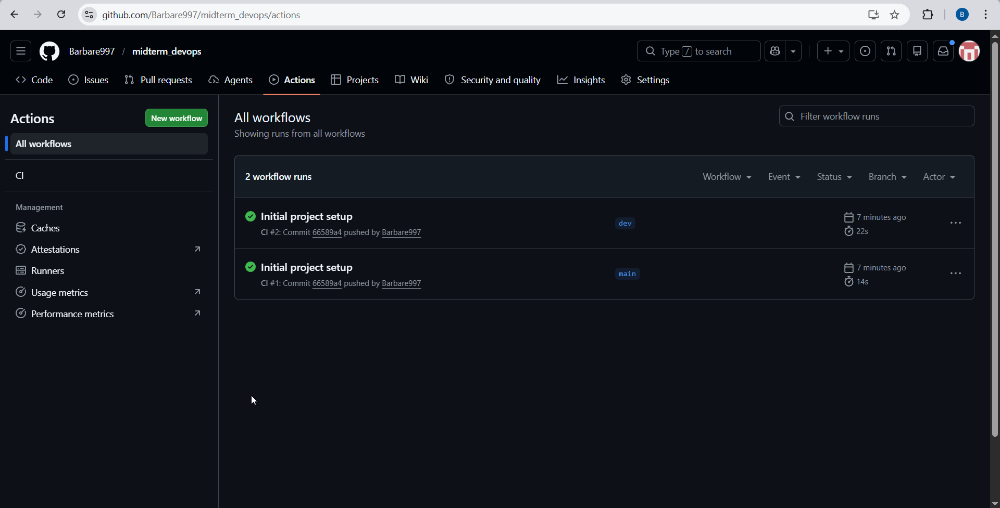
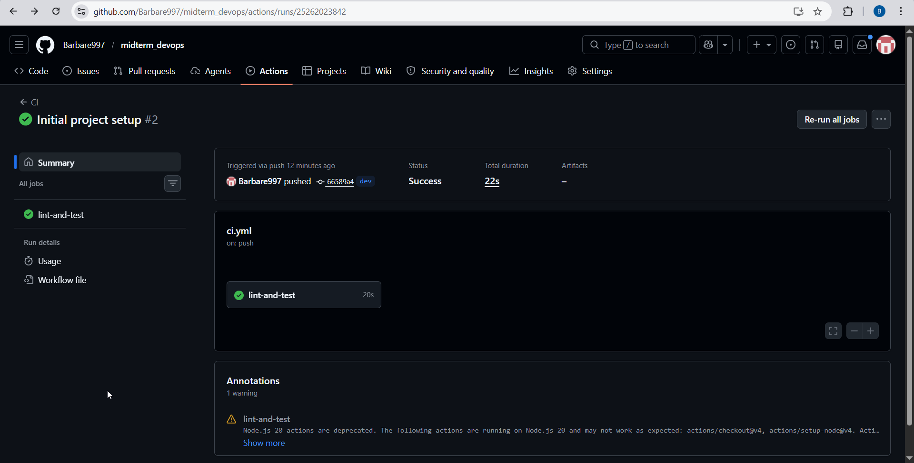
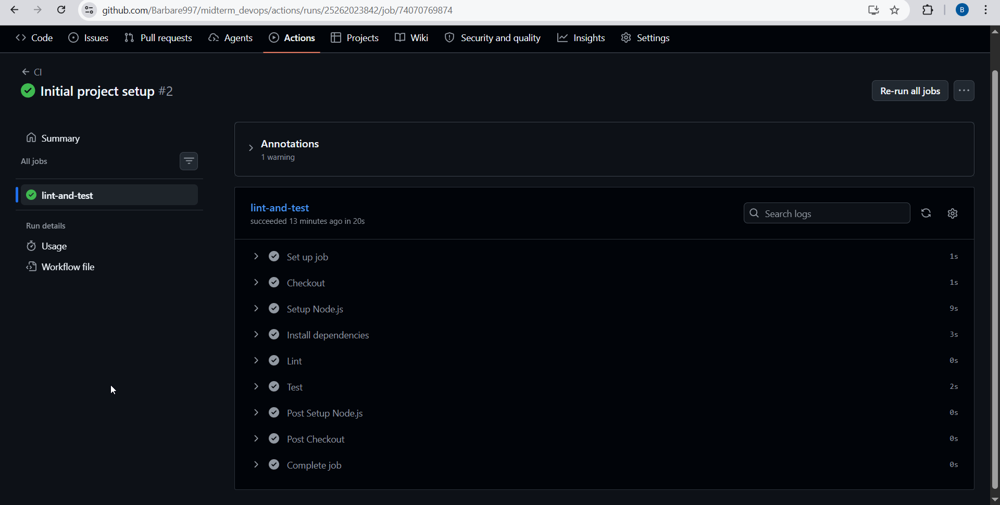
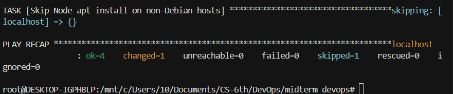
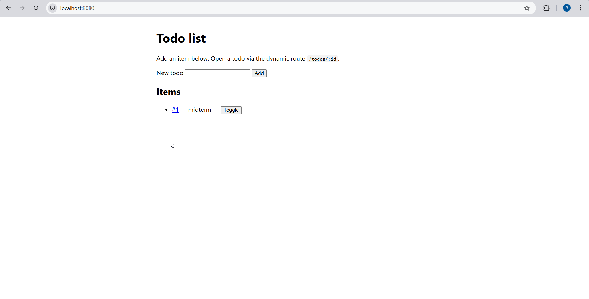
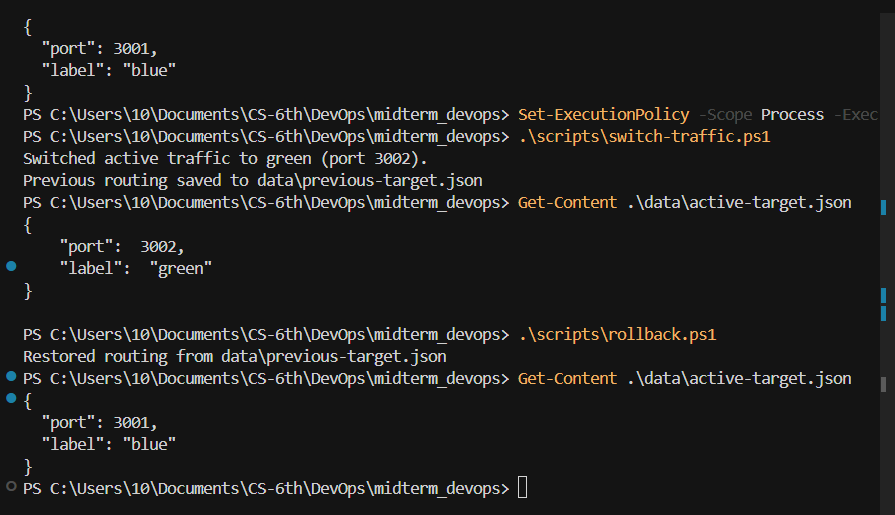
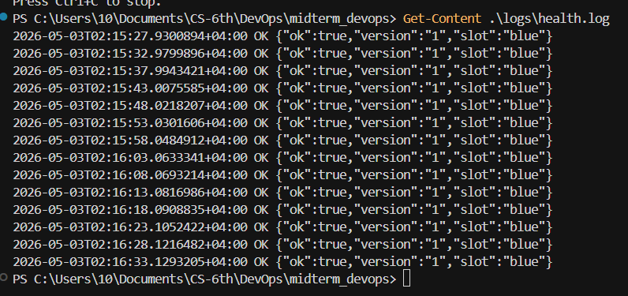

# Midterm Project

Todo list web application with CI, infrastructure automation, blue-green deployment simulation, rollback scripts, and periodic health monitoring.

## Tech stack

- Node.js 18+
- Express
- Jest + Supertest
- ESLint
- GitHub Actions
- Ansible

## Application

- Dynamic route: `GET /todos/:id`
- Input endpoint: `POST /todos`
- Form UI: `GET /`
- Health endpoint: `GET /health`

## Local setup

```bash
npm ci
npm run lint
npm test
npm start
```

Windows PowerShell (same steps; run from the repo folder):

```powershell
npm ci
npm run lint
npm test
npm start
```

App URL: `http://localhost:3000/`

## Blue-green deployment simulation

Run two app instances:

- Blue: port `3001`
- Green: port `3002`

Use **three terminals**. If PowerShell blocks scripts, run once per session:

```powershell
Set-ExecutionPolicy -Scope Process -ExecutionPolicy Bypass
```

**Windows PowerShell**

Terminal A (blue):

```powershell
$env:PORT="3001"
$env:DEPLOY_SLOT="blue"
$env:APP_VERSION="1"
npm start
```

Terminal B (green):

```powershell
$env:PORT="3002"
$env:DEPLOY_SLOT="green"
$env:APP_VERSION="2"
npm start
```

Terminal C (router):

```powershell
npm run start:router
```

**macOS / Linux**

Terminal A (blue):

```bash
PORT=3001 DEPLOY_SLOT=blue APP_VERSION=1 npm start
```

Terminal B (green):

```bash
PORT=3002 DEPLOY_SLOT=green APP_VERSION=2 npm start
```

Terminal C (router):

```bash
npm run start:router
```

Router URL: `http://localhost:8080/`

Switch active traffic:

- Windows: `.\scripts\switch-traffic.ps1`
- Linux/macOS: `bash scripts/switch-traffic.sh`

Rollback:

- Windows: `.\scripts\rollback.ps1`
- Linux/macOS: `bash scripts/rollback.sh`

## Monitoring

Periodic health checks are logged to `logs/health.log`.

- Windows: `.\scripts\health-monitor.ps1`
- Linux/macOS: `bash scripts/health-monitor.sh`

## Infrastructure automation

```bash
ansible-playbook ansible/site.yml
```

On Windows, run this from **WSL (Ubuntu)**. Install Ansible inside WSL (`sudo apt install ansible`), `cd` to the project path under `/mnt/c/...`, then run the command above. The playbook still targets the same repo files on your Windows drive.

## CI pipeline

Workflow file: `.github/workflows/ci.yml`

Runs on push and pull request:

- `npm ci`
- `npm run lint`
- `npm test`

## Screenshots

### CI — workflow runs (`main` and `dev`)



### CI — job summary (green run)



### CI — lint and test steps (expanded log)



### Ansible



### Deployment — app through router (`http://localhost:8080`)



### Blue-green — switch and rollback (terminal output)



### Monitoring — health log (`logs/health.log`)



### CI/CD workflow diagram

```
Developer
   |
   |  git push / pull request
   v
GitHub Actions (CI)
   |-- npm ci
   |-- npm run lint
   '-- npm test

Developer machine (local "production" demo)
   |
   |  ansible-playbook ansible/site.yml  (environment prep)
   v
Two backends
   |-- Blue app  :3001
   '-- Green app :3002
           ^
           |
   Router :8080 (src/router.js)
           |
           |  reads
           v
   data/active-target.json
      ^            ^
      |            |
      |     switch-traffic script
      |            |
      '---- rollback script

Health monitor script
   |
   |  polls http://localhost:8080/health
   v
logs/health.log
```

## Repository

https://github.com/Barbare997/midterm_devops

